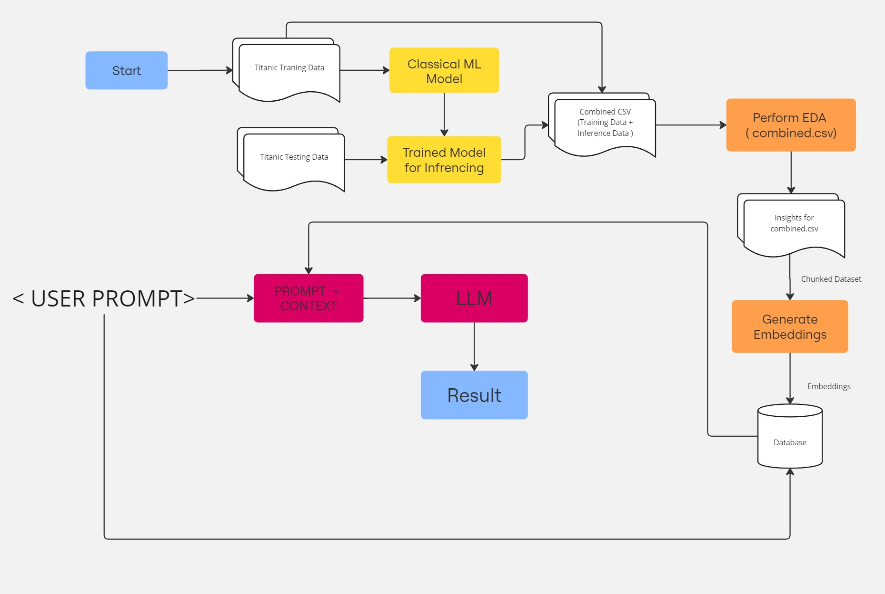
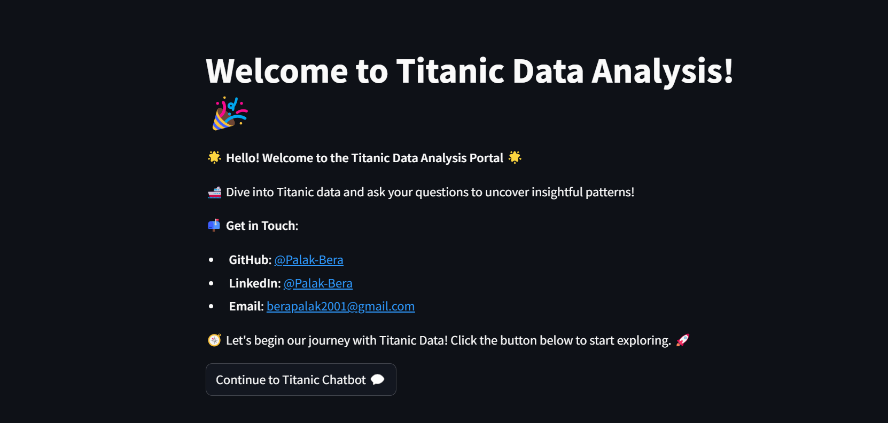
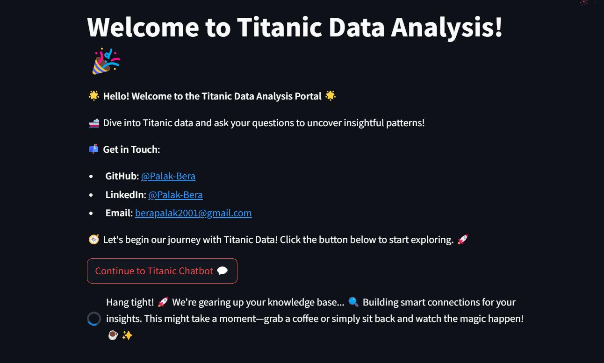
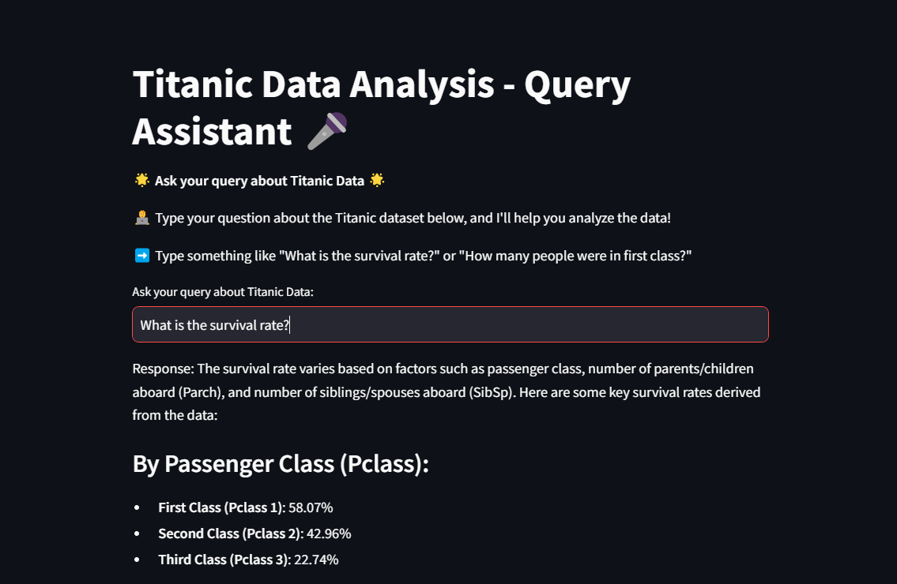
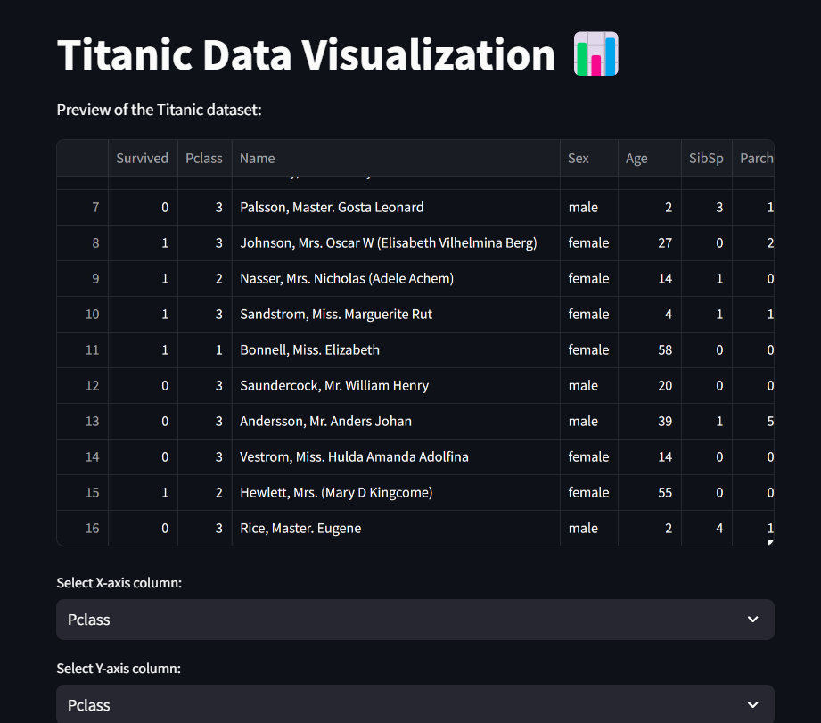
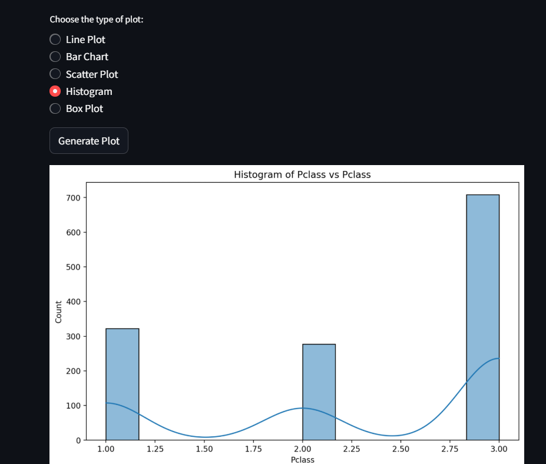

# Titanic Survival Prediction and Insights

This repository provides an end-to-end solution for predicting Titanic survival outcomes, performing in-depth exploratory data analysis (EDA), and hosting the results in an interactive Streamlit application.

---

## Overview

The Titanic dataset from Kaggle is used to predict survival outcomes based on passenger details. The pipeline includes model training, inference, data merging, EDA, and visualization. Results are exported as a CSV and PDF report for further usage, such as integration into local knowledge or an interactive app.

| **Category**         | **Details**                                                                                      |
|-----------------------|-------------------------------------------------------------------------------------------------|
| **Dataset Used**      | Titanic dataset from Kaggle (`train.csv` and `test.csv`).                                       |
| **Objective**         | Predict survival and analyze passenger data for actionable insights.                            |
| **Models Used**       | Logistic Regression, Support Vector Classifier (SVC), and Random Forest.                        |
| **Best Model**        | Logistic Regression with ~82% accuracy on training data.                                        |
| **Outputs**           | Final combined CSV, PDF report with insights, and a hosted Streamlit app.                       |
| **Hosted App**        | [Titanic Survival Streamlit App](https://titanic-insights.streamlit.app/).                      |

---

## Flowchart
### Home Page


## Workflow

### Dataset Details
1. **Train Dataset (`train.csv`)**  
   Contains passenger features (e.g., `Age`, `Fare`, `Pclass`, `Sex`) and survival labels.
2. **Test Dataset (`test.csv`)**  
   Contains similar features but without survival labels (used for inference).

### Steps
1. **Data Preprocessing**
   - Handled missing values in features like `Age`, `Fare`, and `Embarked`.
   - Created new features:
     - `FamilySize = SibSp + Parch + 1`
     - `IsAlone = 1` if `FamilySize == 1`, else `0`.
   - Encoded categorical variables (e.g., `Sex`, `Embarked`) using label encoding.

2. **Model Training**
   - Trained Logistic Regression, Support Vector Classifier (SVC), and Random Forest models.
   - Evaluated model performance using accuracy and selected Logistic Regression as the best-performing model (~82%).

3. **Inference**
   - Used the trained Logistic Regression model to predict survival on the `test.csv` dataset.
   - Combined training data (with actual survival labels) and test data (with predicted survival labels) into a single CSV (`final_combined.csv`).

4. **Exploratory Data Analysis (EDA)**
   - Conducted in-depth analysis on the combined dataset.
   - Generated insights and visualizations for demographics, survival trends, ticket classes, and other features.
   - Saved insights and plots in a PDF report (`eda_report.pdf`).

5. **Streamlit App**
   - Developed a Streamlit app to visualize predictions and EDA insights interactively.

---

## Insights from EDA

### Key Findings
1. **Survival Analysis**
   - **Gender**: Females survived at a much higher rate (~74%) compared to males (~18%).
   - **Class**: First-class passengers had the highest survival rate (~62%), while third-class passengers had the lowest (~24%).

2. **Demographics**
   - **Age Distribution**:
     - Children (ages 0-10) had a higher survival rate (~58%) than adults (~38%).
     - Elderly passengers (>60 years) had the lowest survival chances (~12%).
   - **Family Size**:
     - Passengers with small family sizes (2-4 members) had better survival chances.
     - Solo travelers and passengers with large families (>4 members) had lower survival rates.

3. **Economic Insights**
   - **Ticket Fare**:
     - Passengers paying higher fares had better survival chances.
     - Median fare for survivors was ~£48, while for non-survivors it was ~£22.
   - **Embarkation Point**:
     - Passengers embarking from Cherbourg (C) had the highest survival rate (~55%).

4. **Relationships**
   - **IsAlone**:
     - Passengers traveling alone survived at a rate of ~30%, compared to ~50% for those with family.

### Example Visualizations
- **Survival by Gender and Class**
- **Age Distribution and Survival Rates**
- **Fare Distributions for Survivors vs. Non-Survivors**
- **Impact of Family Size on Survival**

---

## Outputs

### Files
| **File Name**         | **Description**                                                                              |
|-----------------------|----------------------------------------------------------------------------------------------|
| `final_combined.csv`  | Combined dataset of training data (actual labels) and test data (predicted labels).          |
| `eda_report.pdf`      | PDF report containing EDA insights and visualizations.                                       |

---

## How to Run the Repository

### Prerequisites
- Python 3.8+
- Required packages (specified in `requirements.txt`)

### Steps
1. **Clone the Repository**
   ```bash
   git clone https://github.com/your-repo/titanic-survival-prediction.git
   cd titanic-survival-prediction

2. **Install required dependencies**
   ```bash
    pip install -r requirements.txt

4. **Set your OpenAI and Pinecon API Key in .env file**

3.  **Run Streamlit Application**
    ```bash
    streamlit run app.py

---


## Screenshots

### Home Page


### Knowledge Base Generation


### Model Prediction Page



### Plotting Data Page



### Plotting Data Page


## Deployed App

Application Deploy using Streamlit community cloud.

 ```bash
https://titanic-insights.streamlit.app/


